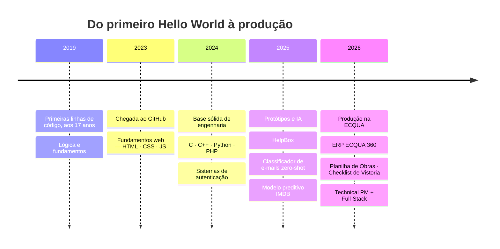

<!-- ═══════════════════════════════════════════════════════════════════════════════ -->
<!-- HEADER — WAVING GRADIENT + IDENTITY                                             -->
<!-- ═══════════════════════════════════════════════════════════════════════════════ -->

  

  

  **Transformo complexidade técnica em valor estratégico de negócio.**
  São José dos Campos — SP, Brasil 🇧🇷

  
  
  
  

    

  )
  
  

---

<!-- ═══════════════════════════════════════════════════════════════════════════════ -->
<!-- ABOUT — STRATEGIC PROFILE                                                       -->
<!-- ═══════════════════════════════════════════════════════════════════════════════ -->

## 👨‍💼 Executive Summary

<table>
<tr>
<td width="60%" valign="top">

Engenheiro de Software e Gestor de Projetos focado em **resultados**. Programo desde os 17 anos e hoje atuo na interseção entre engenharia e negócios: lidero produto como **Technical PM / Product Owner** na ECQUA Engenharia e coloco a mão na massa como **Full-Stack** nos sistemas que a operação usa todos os dias.

- 🚀 **Especialista Ágil** — Scrum e Kanban para otimizar fluxo e previsibilidade de entrega
- 🛠️ **Arquitetura Técnica** — visão sistêmica para soluções robustas em ecossistemas web
- 📊 **Data-Driven** — decisões guiadas por métricas de performance, adoção e UX
- 🏗️ **Construction Tech** — ERPs e ferramentas de campo para engenharia civil

</td>
<td width="40%" valign="top">

> ### 📌 Quick Info
>
> | | |
> | --- | --- |
> | **Role** | Technical PM / Product Owner |
> | **Company** | ECQUA Engenharia |
> | **Focus** | Construction Tech & ERPs |
> | **Stack atual** | Next.js · TypeScript · Supabase |
> | **Método** | Agile / Lean |
> | **Base** | São José dos Campos — SP |

</td>
</tr>
</table>

> [!TIP]
> **Este README se atualiza sozinho.** Três GitHub Actions rodam em ciclo: 🐍 a snake devora minhas contribuições diariamente, 📅 o calendário isométrico é regenerado toda madrugada (com as métricas ao vivo logo abaixo sincronizadas por bot), e 📦 a vitrine de repositórios recentes se renova a cada 12 horas.

---

<!-- ═══════════════════════════════════════════════════════════════════════════════ -->
<!-- LIVE METRICS — AUTO-SYNCED BY GITHUB ACTIONS (do not edit values by hand)       -->
<!-- ═══════════════════════════════════════════════════════════════════════════════ -->

## ⚡ Live Metrics · sincronizado diariamente via GitHub Actions

<table>
<tr>
<td width="55%" valign="middle" align="center">

</td>
<td width="45%" valign="middle">

### 🔥 Ritmo de entrega

- 📌 Streak: **19 dias** de contribuições consecutivas
- ⭐ Best: **206/dia** — recorde em um único dia
- ⚡ Média: **~7.2/dia** de contribuições no ano

Números extraídos do calendário isométrico e commitados automaticamente pelo workflow `isometric-calendar.yml`.

</td>
</tr>
</table>

  

---

<!-- ═══════════════════════════════════════════════════════════════════════════════ -->
<!-- PRODUCTION SYSTEMS — REAL DELIVERIES, REAL USERS                                -->
<!-- ═══════════════════════════════════════════════════════════════════════════════ -->

## 🏭 Systems in Production

<!-- Ajuste aqui status, links e métricas reais de usuários quando quiser expor números. -->

| Sistema | Stack | Status | Entrega |
| :--- | :--- | :---: | :--- |
| **ECQUA 360** — ERP de engenharia |    | 🟢 Produção | ERP completo para gestão de obras: autenticação, medições e operação diária da ECQUA Engenharia |
| **Planilha de Obras** (geral + particulares) |  | 🟢 Produção | Controle centralizado de obras em uso pela equipe de engenharia |
| **Checklist de Vistoria** |   | 🟢 Produção | Vistorias de campo padronizadas, direto do canteiro |
| **HelpBox** |  | 🧪 Beta | Plataforma de suporte/helpdesk — do protótipo à web |
| **Trilha** |  | 🚧 Em evolução | Produto em desenvolvimento ativo |

<b>🤖 Bônus: entregas com IA</b> — clique para expandir

 

| Projeto | O que faz |
| :--- | :--- |
| [**classifyemail**](https://github.com/micaiasviola/classifyemail) | Classificador automático de e-mails com IA zero-shot (Python) |
| [**Modelo-Preditivo-IMDB**](https://github.com/micaiasviola/Modelo-Preditivo-IMDB) | Modelo preditivo de notas do IMDB (Jupyter / data science) |

---

<!-- ═══════════════════════════════════════════════════════════════════════════════ -->
<!-- JOURNEY — MERMAID TIMELINE (renders natively on GitHub)                         -->
<!-- ═══════════════════════════════════════════════════════════════════════════════ -->

## 🗺️ Dev Journey

---

<!-- ═══════════════════════════════════════════════════════════════════════════════ -->
<!-- TECH STACK — BADGES + SKILL ICONS                                               -->
<!-- ═══════════════════════════════════════════════════════════════════════════════ -->

## 🛠️ Tech Arsenal

### Frontend
     

### Backend & Data
      

### DevOps & Tools
     

### Management
    

 

<b>🧭 Core Competencies Matrix</b> — visão completa por área

 

| **Leadership & Management** | **Frontend Mastery** | **Backend & Database** | **DevOps & Tools** |
| :--- | :--- | :--- | :--- |
| 📘 Agile (Scrum/Kanban) | ⚛️ React.js & Next.js | 🟢 Node.js & PHP | 🐳 Docker & Linux |
| 📈 OKRs & KPIs Analysis | 🎨 TailwindCSS & SCSS | 💾 PostgreSQL & Supabase | 🔄 GitHub Actions |
| 🧩 Risk Management | ⌨️ TypeScript & ES6+ | 🐍 Python & Flask | 🔧 Postman & Insomnia |
| 🗺️ Product Roadmap | 🚀 Vite & Framer Motion | 🔗 Prisma & GraphQL | 🎨 Figma & UI/UX |
| 🤝 Stakeholder Mgmt | 🛠️ Lucide & Shadcn/UI | 🔐 JWT & Auth Patterns | ☁️ AWS (S3 / EC2) |

---

<!-- ═══════════════════════════════════════════════════════════════════════════════ -->
<!-- ENGINEERING METRICS — DUAL-THEME STATS                                          -->
<!-- ═══════════════════════════════════════════════════════════════════════════════ -->

## 📊 Engineering Metrics

  <picture>
    <source media="(prefers-color-scheme: dark)" srcset="https://github-readme-stats.vercel.app/api?username=micaiasviola&show_icons=true&theme=tokyonight&hide_border=true&bg_color=1a1b26&border_radius=10&include_all_commits=true&rank_icon=github" />
    
  </picture>
  <picture>
    <source media="(prefers-color-scheme: dark)" srcset="https://github-readme-stats.vercel.app/api/top-langs/?username=micaiasviola&layout=compact&theme=tokyonight&hide_border=true&bg_color=1a1b26&border_radius=10&langs_count=10" />
    
  </picture>

  <picture>
    <source media="(prefers-color-scheme: dark)" srcset="https://github-readme-activity-graph.vercel.app/graph?username=micaiasviola&theme=tokyo-night&hide_border=true&area=true&bg_color=1a1b26" />
    
  </picture>

<b>🔬 Mais métricas</b> — perfil detalhado, horários produtivos e commits por linguagem

 

  <picture>
    <source media="(prefers-color-scheme: dark)" srcset="https://github-profile-summary-cards.vercel.app/api/cards/profile-details?username=micaiasviola&theme=tokyonight" />
    
  </picture>

  <picture>
    <source media="(prefers-color-scheme: dark)" srcset="https://github-profile-summary-cards.vercel.app/api/cards/productive-time?username=micaiasviola&theme=tokyonight&utcOffset=-3" />
    
  </picture>
  <picture>
    <source media="(prefers-color-scheme: dark)" srcset="https://github-profile-summary-cards.vercel.app/api/cards/most-commit-language?username=micaiasviola&theme=tokyonight" />
    
  </picture>

---

<!-- ═══════════════════════════════════════════════════════════════════════════════ -->
<!-- ACHIEVEMENTS — TROPHY SHELF                                                     -->
<!-- ═══════════════════════════════════════════════════════════════════════════════ -->

## 🏆 Achievements

  <picture>
    <source media="(prefers-color-scheme: dark)" srcset="https://github-profile-trophy.vercel.app/?username=micaiasviola&theme=tokyonight&no-frame=true&no-bg=true&margin-w=8&column=7" />
    
  </picture>

---

<!-- ═══════════════════════════════════════════════════════════════════════════════ -->
<!-- DEVELOPMENT PULSE — SNAKE EATING CONTRIBUTIONS                                  -->
<!-- ═══════════════════════════════════════════════════════════════════════════════ -->

## 🐍 Development Pulse

  <picture>
    <source media="(prefers-color-scheme: dark)" srcset="https://raw.githubusercontent.com/micaiasviola/micaiasviola/main/dist/github-contribution-grid-snake-dark.svg" />
    
  </picture>

---

<!-- ═══════════════════════════════════════════════════════════════════════════════ -->
<!-- REPOSITORY SHOWCASE — AUTO-UPDATED EVERY 12H                                    -->
<!-- ═══════════════════════════════════════════════════════════════════════════════ -->

## 🎯 Latest Shipments · vitrine renovada a cada 12h por bot

<!-- RECENT_REPOS_START -->
  <table>
    <tr>
      <td></td>
      <td></td>
    </tr>
    <tr>
      <td></td>
      <td></td>
    </tr>
  </table><!-- RECENT_REPOS_END -->

---

<!-- ═══════════════════════════════════════════════════════════════════════════════ -->
<!-- PHILOSOPHY FOOTER — THE SOUL IN THE MACHINE                                     -->
<!-- ═══════════════════════════════════════════════════════════════════════════════ -->

 

### Let's build the future together ✨

*Sempre aberto a novas conexões, discussões técnicas e oportunidades de liderança.*

$$\text{café} + \text{código} + \text{método} \Rightarrow \text{entrega}$$

[**📧 Email**](mailto:leo.micaias@gmail.com) • [**💬 Discord**](https://discord.com/users/355140955168440330) • [**🔗 LinkedIn**](https://www.linkedin.com/in/micaias-viola-12857920a)

 

`MICAÍAS VIOLA // BUILT IN PUBLIC · UPDATED BY ROBOTS`

  

